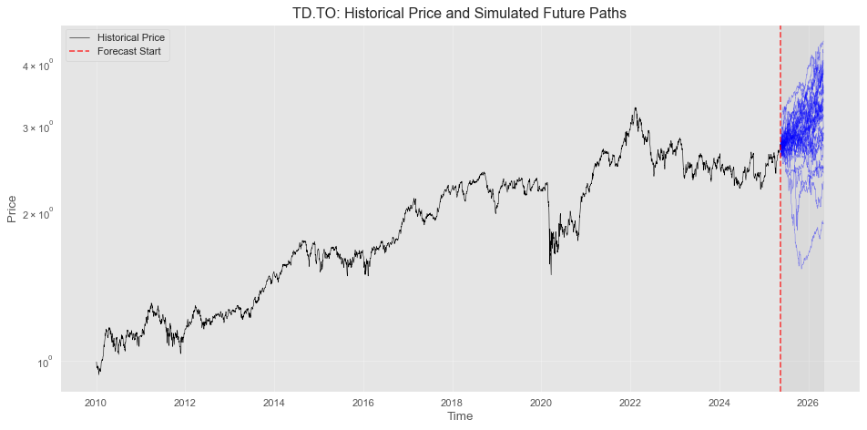
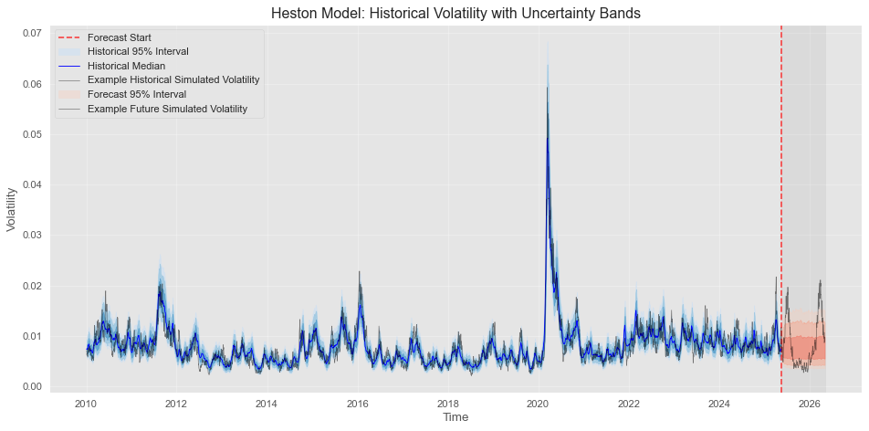
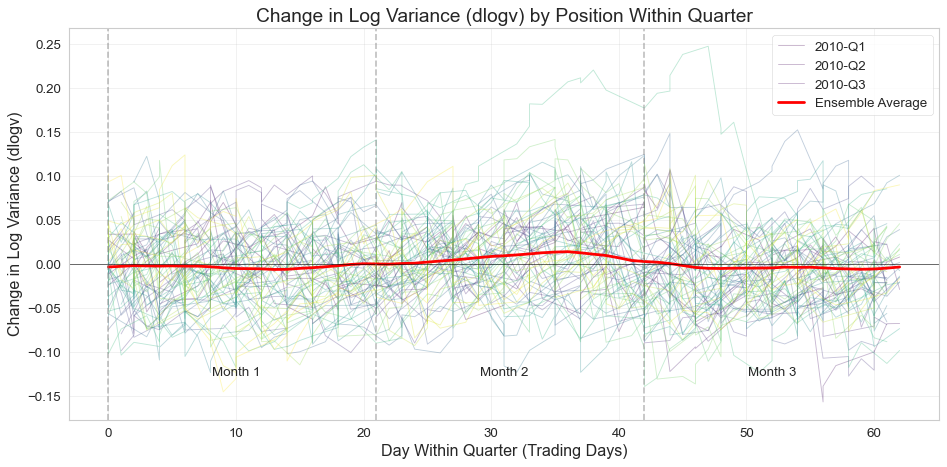

# Bayesian Heston Model of Financial Assets 
A stan implementation of the Heston model, with some adjustments which better reflect real financial assets, such as fat-tailed distributions of returns, and quarterly seasonality.


## Quick Start

See the notebooks folder for a hands-on example.

## Theory and Model

The Heston model is essentially two coupled SDEs where the asset price change is a simple drift/Weiner process, but the scale of the Weiner process, volatility, is itself an Ornstein-Uhlenbeck process. This choice ensures that volatilility will cluster -- a desireable modelling phenomenon -- and we can spot market regime changes and model tail risk more effectively. 
```math
\begin{align}
dS_t &= \mu S_t dt + \sqrt{v_t} S_t dW_t^S \\
dv_t &= \kappa(\theta - v_t)dt + \sigma \sqrt{v_t}dW_t^v
\end{align}
```
Where $S_t$ is the asset price, $dt$ is taken to be one day (so that the SDE is an Euler approximation). $\mu$ is asset drift, $v_t$ is volatility, $\kappa$ is the mean reversion strength, $\theta$ is the long-term mean of volatility, $\sigma$ is the standard deviation (scale) of volatility. Lastly, $dW$ are the Weiner process sample, which sample jointly from a multivariate Gaussian distribution.
```math
\begin{bmatrix}
\mathrm{d}W_r \\
\mathrm{d}W_v
\end{bmatrix}
\sim
\mathcal{N}\!\left(
\begin{bmatrix}
0 \\
0
\end{bmatrix},
\;
\Delta t
\begin{bmatrix}
1 & \rho \\
\rho & 1
\end{bmatrix}
\right)

```

Figure 2 - A Bayesian estimate of the true realization of the volatility of the Toronto Dominion (TD) stock from 2010 to mid 2025. It also has a 1-year out of sample simulation ensemble. One can see that the behaviour is largly not-interesting as an ensemble, but each realization seems reasonably complex. In other words the predictivity is limited but the risk dynamics is somewhat sophisticated.

## Modifications

1. **Log-Space Formulation**: We model log-variance instead of variance to improve numerical stability:
   $$d\log(v_t) = \kappa(\log(\theta) - \log(v_t))dt + \sigma dW_t^v$$

This adds a term to the returns SDE by Ito's lemma (see next modification.)

2. **Fat-Tailed Returns**: We use Student-t distributions for returns rather than Gaussian, providing better modeling of extreme market events:
   $$r_t \sim \text{Student-t}(\nu, \mu - \frac{v_t}{2}, \sqrt{v_t})$$

3. **Seasonal Effects**: We incorporate quarterly seasonal patterns through Fourier series with exponential decay:
   $$\text{seasonal}(t) = e^{-\delta t} \sum_{i=1}^K [a_i \sin(2\pi i t/P) + b_i \cos(2\pi i t/P)]$$



4. **Bayesian Framework**: We use full Bayesian inference to quantify uncertainty in all parameters and forecasts.


## Limitations and Possible Improvements

- See in the stochastic volatility plot, that some values lie extremely far outside of the steady state range, suggesting a statistically-significant discrepency between model and reality. This is because volatility has some statistics not captured in the urrent model. In particular I see two phenomena: firstly, there are large shocks to volatility which are lopsided towards higher values, and promptly revert back to the mean. This is not captured well enough with the fat-tailed student-t distribution and likely needs some more work. Secondly, I see that the long-term mean seems to vary with time, not remaining constant. This 2-timescale nature is hard to capture but I as thinking of representing the long term mean as a GP with a slow-varying prior on the kernel.
- The above might be remedied by a GP long-term average volatility, and perhaps making volatility a student-t or skewed student-t. We might also consider a HMC (Hidden Markov Chain) state which represents bullish/bearish regimes. Other things I've thought of are "Hawkes Process" volatility, jump stochastic volatility, or asymetrical mean reversion (think square on one side, linear on the other) or state-varying mean reversion parameter, $\kappa_t = \kappa(\{ dv_{t-1},...,dv_{t-\tau}\})$. 
- The parameter $\rho$ is a bit pathological in the sampling stage. It seems to be hard for the model to estimate, and so I put a somewhat tight prior onto negative correlations.

